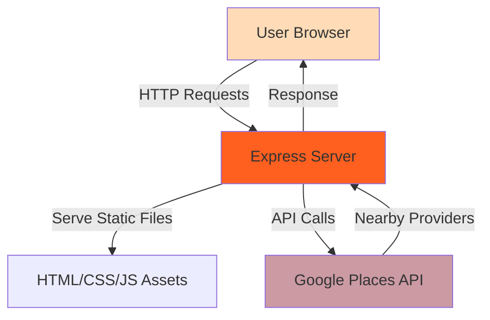

# Luna - Pet Health Management Platform

Luna is a web-based pet healthcare platform that helps pet owners manage their pets' health records, medications, and veterinary appointments. Built by KANJ, this application provides an intuitive interface for tracking pet wellness and finding nearby veterinary care providers.

## Key Features

- **Medication Management** - Track pet medications, dosages, and administration schedules ([`Luna/public/medications.html`](Luna/public/medications.html))
- **Nearby Veterinary Provider Search** - Find veterinarians and pet clinics using Google Places API integration ([`Luna/server.js:11-28`](Luna/server.js#L11-L28))
- **Pet Health Dashboard** - Centralized view of pet health information and records ([`Luna/public/dashboard.html`](Luna/public/dashboard.html))
- **User Authentication** - Login and signup functionality for secure access ([`Luna/server.js:79-103`](Luna/server.js#L79-L103))
- **Responsive Web Interface** - Modern, mobile-friendly design using HTML5 UP templates

## Architecture Overview

Luna is built as a Node.js/Express web application with a traditional server-side rendering architecture. The system consists of:

- **Frontend**: Static HTML pages with jQuery-based interactions
- **Backend**: Express.js server handling routing and API integration
- **External Services**: Google Places API for veterinary provider location services

For detailed architecture documentation, see [docs/ARCHITECTURE.md](docs/ARCHITECTURE.md).



## Quickstart

### Prerequisites

- **Node.js** v14.0.0 or higher
- **npm** v6.0.0 or higher
- **Google Places API key** (for provider search functionality)

### Installation

1. Clone the repository:
```bash
git clone https://github.com/jakujobi/Kanj.git
cd Kanj/Luna
```

2. Install dependencies:
```bash
npm install
```

3. Configure environment variables (see [Configuration](#configuration) section below)

### Configuration

Create a `.env` file in the `Luna/` directory or modify `server.js` to set your Google Places API key:

```javascript
const GOOGLE_PLACES_API_KEY = 'your-api-key-here';
```

**⚠️ Security Note**: The current implementation has a hardcoded API key in `server.js` (line 7). This should be moved to environment variables before deploying to production. See [SECURITY.md](SECURITY.md) for details.

### Run

Start the development server:

```bash
npm start
```

The application will be available at `http://localhost:3000`

### Minimal Example Usage

1. Navigate to `http://localhost:3000` in your web browser
2. You'll see the Luna landing page with login form
3. Access `/dashboard` to view the pet health dashboard
4. Navigate to `/medications` to view medication schedules
5. Visit `/schedule_appt` to find nearby veterinary providers

## Usage

### Available Routes

| Route | Description | File |
|-------|-------------|------|
| `/` | Landing page with login form | `public/index.html` |
| `/signup` | User registration page | `public/signup.html` |
| `/login` | Login authentication | `server.js:95-103` |
| `/dashboard` | Main pet health dashboard | `public/dashboard.html` |
| `/my_pets` | Pet list management | `public/pet_list.html` |
| `/schedule_appt` | Find veterinary providers | `public/schedule_appt.html` |
| `/medications` | Medication tracking | `public/medications.html` |

### Google Places API Integration

The application searches for nearby veterinary care providers using:

```javascript
// Default search parameters (San Francisco coordinates)
const latitude = 37.7749;
const longitude = -122.4194;
const radius = 482803; // ~300 miles in meters
```

Search results are automatically injected into the appointment scheduling page on server startup.

### Common Workflows

**Adding a medication schedule:**
1. Navigate to `/medications`
2. View existing medication information for pets
3. *(Note: Medication data is currently static HTML - dynamic editing requires future implementation)*

**Finding nearby veterinarians:**
1. Navigate to `/schedule_appt`
2. View pre-loaded list of nearby providers
3. *(Note: Real-time location search requires future implementation)*

## Configuration

### Environment Variables

| Variable | Description | Required | Default |
|----------|-------------|----------|---------|
| `GOOGLE_PLACES_API_KEY` | API key for Google Places | Yes | *(hardcoded in server.js)* |
| `PORT` | Server port number | No | `3000` |

### Configuration Files

- `Luna/package.json` - Node.js dependencies and scripts
- `Luna/server.js` - Server configuration and routing
- `.env` - Environment variables (create from `.env.example`)

## Testing & Quality

### Running the Application

```bash
cd Luna
npm start
```

### Manual Testing

1. Start the server: `npm start`
2. Open browser to `http://localhost:3000`
3. Verify landing page loads correctly
4. Test navigation between dashboard sections
5. Check that nearby providers are displayed on `/schedule_appt`

### Code Quality Notes

- No automated tests currently implemented
- No linting configuration present
- No CI/CD pipeline configured

**TODO**: Add automated testing framework (Jest/Mocha recommended)

## Project Status & Roadmap

**Current Status**: Early development / Prototype

### Implemented
- ✅ Basic Express server setup
- ✅ Static page routing
- ✅ Google Places API integration
- ✅ Medication tracking UI
- ✅ Provider search functionality

### Known Limitations
- ⚠️ Hardcoded API credentials (security risk)
- ⚠️ No database integration (data is static HTML)
- ⚠️ Login/signup forms are non-functional (no backend implementation)
- ⚠️ No user session management
- ⚠️ No real-time location-based search
- ⚠️ Limited error handling

### Future Roadmap
- 🔲 Database integration (MongoDB/PostgreSQL)
- 🔲 User authentication system
- 🔲 Dynamic medication CRUD operations
- 🔲 Real-time geolocation for provider search
- 🔲 Appointment scheduling backend
- 🔲 Pet profile management
- 🔲 Email/SMS notifications for medications
- 🔲 Multi-pet household support

## What This Project Demonstrates

This project showcases practical software engineering skills:

- **Full-Stack Web Development** - Node.js/Express backend with HTML/CSS/JavaScript frontend ([`Luna/server.js`](Luna/server.js), [`Luna/public/`](Luna/public/))
- **RESTful API Integration** - Google Places API for location-based services ([`Luna/server.js:11-28`](Luna/server.js#L11-L28))
- **Server-Side Rendering** - Dynamic HTML generation from API data ([`Luna/server.js:30-52`](Luna/server.js#L30-L52))
- **File System Operations** - Reading and modifying HTML files programmatically ([`Luna/server.js:54-71`](Luna/server.js#L54-L71))
- **Responsive Web Design** - Mobile-first UI using HTML5 UP templates ([`Luna/public/assets/`](Luna/public/assets/))
- **Domain Knowledge** - Understanding of pet healthcare workflows and veterinary care systems
- **API Route Design** - Clean URL structure and navigation ([`Luna/server.js:79-143`](Luna/server.js#L79-L143))

## Project Structure

```
Kanj/
├── Luna/               # Main application (Node.js/Express)
│   ├── server.js       # Express server and routing
│   ├── package.json    # Dependencies and scripts
│   ├── public/         # Static HTML/CSS/JS files
│   │   ├── index.html        # Landing page
│   │   ├── dashboard.html    # Main dashboard
│   │   ├── medications.html  # Medication tracking
│   │   └── schedule_appt.html # Provider finder
│   └── node_modules/   # NPM dependencies
├── furluna/            # WordPress backup/alternative version
├── Branding/           # Logo, fonts, and color scheme
├── Images/             # Stock photos and media assets
└── README.md           # This file
```

## Contributing

We welcome contributions! Please see [CONTRIBUTING.md](CONTRIBUTING.md) for guidelines on:
- Code style and conventions
- Submitting pull requests
- Reporting issues
- Development workflow

## Security

**⚠️ Important Security Notice**: This repository contains hardcoded API credentials that should not be used in production. Please review [SECURITY.md](SECURITY.md) for:
- How to properly configure environment variables
- Security best practices
- How to report security vulnerabilities

## License

This project is licensed under the **GNU General Public License v3.0** - see the [LICENSE](LICENSE) file for details.

### Third-Party Licenses

- **HTML5 UP Templates**: Licensed under CCA 3.0 ([html5up.net/license](https://html5up.net/license))
  - Stellar template (landing page)
  - Hyperspace template (dashboard)
- **Express.js**: MIT License
- **Axios**: MIT License

## Credits & Acknowledgements

- **Development Team**: KANJ
- **UI Templates**: [HTML5 UP](https://html5up.net/) - Stellar and Hyperspace themes
- **Stock Images**: Pexels.com photographers (see [`Images/`](Images/) directory)
- **Fonts**: Noto Sans, Unbounded (Google Fonts, OFL license)

## Additional Resources

- **Development Guide**: [docs/DEVELOPMENT.md](docs/DEVELOPMENT.md)
- **Architecture Details**: [docs/ARCHITECTURE.md](docs/ARCHITECTURE.md)
- **Security Information**: [SECURITY.md](SECURITY.md)

---

**Note to Maintainers**: This README was generated through comprehensive repository analysis. Some features mentioned may be partially implemented or in prototype stage. Please verify and update sections marked with TODO or ⚠️ symbols.
