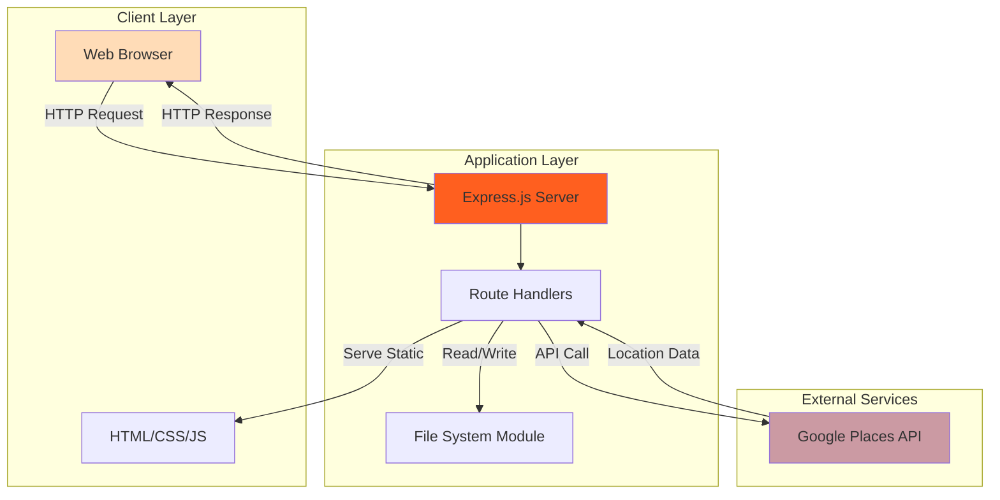
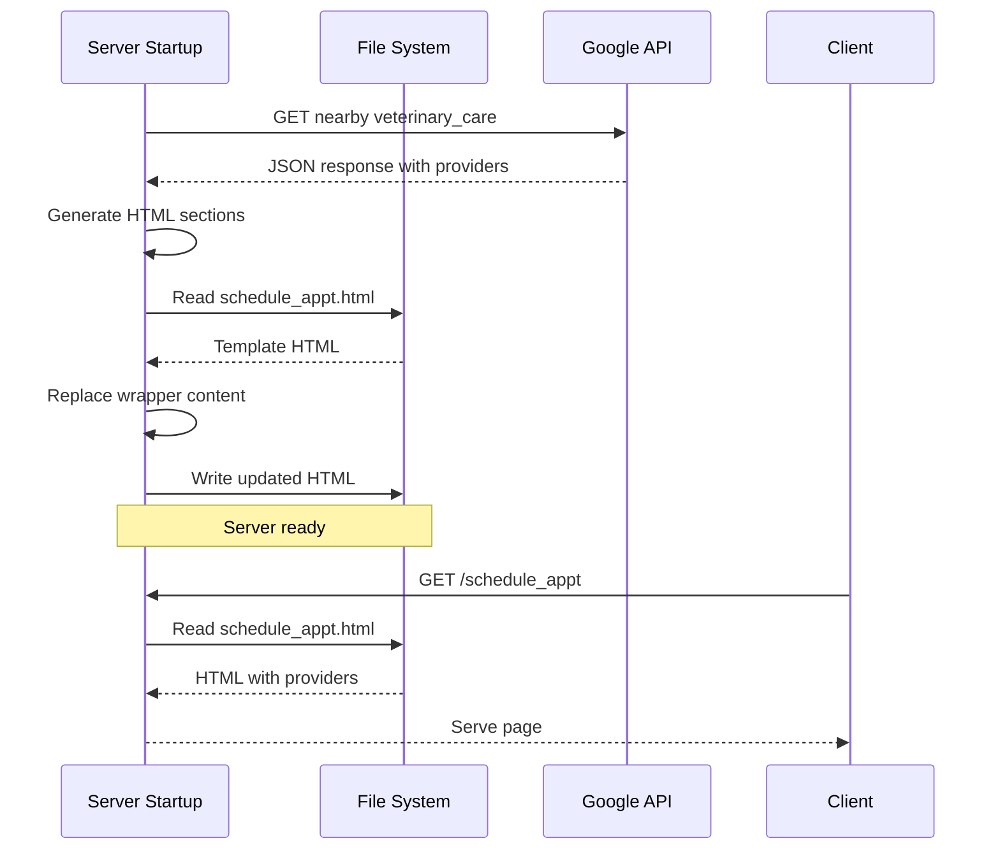
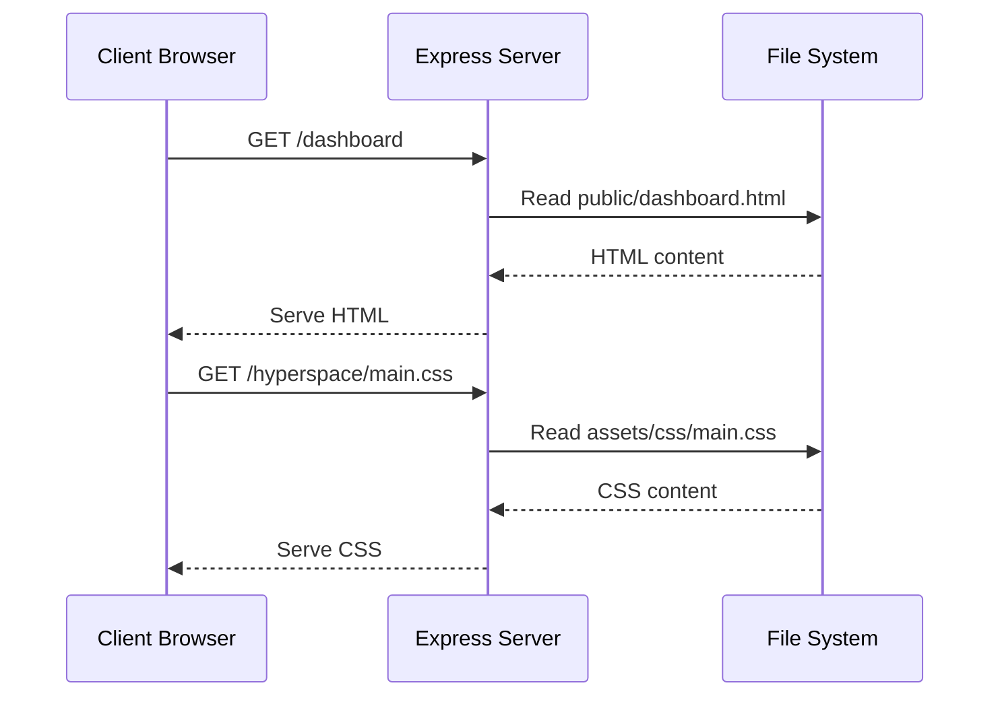

# Architecture Documentation

## System Overview

Luna is a traditional three-tier web application built with Node.js and Express.js. The architecture follows a server-side rendering pattern with static HTML pages enhanced by client-side JavaScript.

## High-Level Architecture



## Components

### 1. Frontend Layer

**Technology**: HTML5, CSS3, jQuery, HTML5 UP Templates

**Key Files**:
- `public/index.html` - Landing page with login form
- `public/dashboard.html` - Main dashboard interface
- `public/medications.html` - Medication tracking interface
- `public/schedule_appt.html` - Provider search results
- `public/assets/` - CSS, JavaScript, and image assets

**Responsibilities**:
- User interface rendering
- Form handling (currently client-side only)
- Navigation between pages
- Responsive layout management

**Templates Used**:
- **Stellar** - Used for landing page (`index.html`)
- **Hyperspace** - Used for dashboard and internal pages

### 2. Application Server

**Technology**: Node.js v14+, Express.js v4.18.2

**Key File**: `server.js`

**Core Modules**:

#### Routing Module
Handles HTTP requests and serves appropriate pages:
```javascript
app.get('/', ...)           // Landing page
app.get('/dashboard', ...)  // Dashboard
app.get('/medications', ...)// Medication tracking
app.get('/schedule_appt', ...)// Provider search
```

#### Google Places Integration Module
```javascript
searchNearbyHospitals(latitude, longitude, radius)
```
- Queries Google Places API for nearby veterinary care providers
- Returns formatted location data
- Configured for 482,803 meter (~300 miles) search radius

#### HTML Generation Module
```javascript
generateHTML(hospitals)
```
- Converts API response to HTML sections
- Injects provider information into page templates
- Includes provider images via Google Photos API

#### File System Module
```javascript
appendHospitalsToListFile(latitude, longitude, radius)
```
- Reads `schedule_appt.html` template
- Replaces placeholder content with live data
- Writes updated HTML back to disk
- **Note**: This happens on server startup, not dynamically

### 3. External Services

#### Google Places API
- **Purpose**: Find nearby veterinary care providers
- **API Endpoints Used**:
  - `/place/nearbysearch/json` - Search for nearby places
  - `/place/photo` - Retrieve place photos
- **Authentication**: API key (currently hardcoded)
- **Rate Limiting**: Subject to Google's standard API limits

## Data Flow

### Provider Search Flow



### Page Request Flow



## Design Patterns

### 1. Static File Serving
Express serves static HTML/CSS/JS files from the `public/` directory with custom route handlers for specific asset paths.

### 2. Template Injection
Server-side HTML modification using Node.js `fs` module to inject dynamic content into static templates.

### 3. Startup Initialization
API calls and data processing occur at server startup rather than on-demand, creating a semi-static site with periodic updates.

## File System Structure

```
Luna/
├── server.js                    # Main application entry point
├── package.json                 # Dependencies and scripts
├── public/                      # Static assets (served to clients)
│   ├── index.html              # Landing page
│   ├── dashboard.html          # Dashboard UI
│   ├── medications.html        # Medication tracking UI
│   ├── schedule_appt.html      # Provider search (modified by server)
│   ├── pet_list.html          # Pet management UI
│   ├── contact_us.html        # Contact form
│   ├── assets/                # Stellar template assets
│   │   ├── css/
│   │   └── js/
│   └── hyperspace/            # Hyperspace template assets
│       ├── assets/
│       │   ├── css/
│       │   └── js/
│       └── LICENSE.txt
├── backup/                     # Backup files
├── temp/                       # Temporary working files
└── node_modules/               # NPM dependencies
```

## Technology Stack

| Layer | Technology | Version | Purpose |
|-------|------------|---------|---------|
| Runtime | Node.js | v14+ | JavaScript execution environment |
| Web Framework | Express.js | 4.18.2 | HTTP server and routing |
| HTTP Client | Axios | 1.6.7 | External API requests |
| Frontend | jQuery | 3.x | DOM manipulation |
| UI Framework | HTML5 UP | - | Responsive templates |
| Styling | CSS3 | - | Visual presentation |

## Security Architecture

### Current State
- ❌ No authentication implementation (forms exist but non-functional)
- ❌ No session management
- ❌ Hardcoded API credentials in source code
- ❌ No input validation or sanitization
- ❌ No HTTPS enforcement
- ❌ No CSRF protection
- ❌ No XSS prevention measures

### Recommended Improvements
1. Implement environment variable configuration
2. Add authentication middleware (Passport.js recommended)
3. Implement session management (express-session)
4. Add input validation (express-validator)
5. Implement CSRF token protection
6. Add rate limiting (express-rate-limit)
7. Enable HTTPS in production
8. Implement Content Security Policy headers

## Scalability Considerations

### Current Limitations
- **Single-threaded**: No clustering or load balancing
- **In-memory only**: No persistent data storage
- **Synchronous file I/O**: Can block event loop
- **Fixed location**: Hardcoded San Francisco coordinates
- **Startup-only updates**: Provider data not refreshed dynamically

### Scaling Recommendations

**Short-term**:
1. Implement caching layer (Redis)
2. Add database for persistent storage (PostgreSQL/MongoDB)
3. Separate static asset serving (CDN/nginx)
4. Implement asynchronous file operations

**Long-term**:
1. Containerize application (Docker)
2. Implement horizontal scaling (Kubernetes)
3. Add load balancer (nginx/HAProxy)
4. Migrate to microservices architecture
5. Implement message queue for async tasks (RabbitMQ/Redis)

## API Endpoints

### Internal Routes

| Method | Path | Handler | Purpose |
|--------|------|---------|---------|
| GET | `/` | `index.html` | Landing page |
| GET | `/signup` | `signup.html` | Registration form |
| POST | `/signup` | Redirect to `/dashboard` | Handle signup (stub) |
| GET | `/login` | `login.html` | Login form |
| POST | `/login` | Redirect to `/dashboard` | Handle login (stub) |
| GET | `/dashboard` | `dashboard.html` | Main dashboard |
| GET | `/my_pets` | `pet_list.html` | Pet management |
| GET | `/schedule_appt` | `schedule_appt.html` | Provider search |
| GET | `/medications` | `medications.html` | Medication tracking |
| GET | `/css/main` | `assets/css/main.css` | Stellar CSS |
| GET | `/css/noscript` | `assets/css/noscript.css` | Stellar no-JS CSS |
| GET | `/hyperspace/main` | `hyperspace/assets/css/main.css` | Hyperspace CSS |
| GET | `/hyperspace/noscript` | `hyperspace/assets/css/noscript.css` | Hyperspace no-JS CSS |

### External API Dependencies

**Google Places API**:
- Endpoint: `https://maps.googleapis.com/maps/api/place/nearbysearch/json`
- Purpose: Search nearby veterinary care providers
- Authentication: API key
- Parameters:
  - `key`: API authentication key
  - `location`: Latitude,longitude coordinates
  - `radius`: Search radius in meters
  - `type`: Place type filter (`veterinary_care`)

## Known Issues & Technical Debt

1. **Hardcoded Credentials**: Google API key exposed in source code
2. **Non-functional Authentication**: Login/signup forms have no backend
3. **Fixed Location**: Hardcoded San Francisco coordinates
4. **Static Data**: No database, all data in HTML
5. **Synchronous File I/O**: Blocking operations in `appendHospitalsToListFile`
6. **Limited Error Handling**: Minimal try-catch blocks
7. **No Input Validation**: Forms accept any input without validation
8. **Mixed Template Systems**: Uses two different HTML5 UP templates
9. **Asset Path Inconsistencies**: Custom routes for CSS files instead of static middleware
10. **Startup-only API Calls**: Provider data not refreshed after initialization

## Future Architecture Recommendations

### Phase 1: Foundation (1-2 months)
- Add environment variable configuration
- Implement database layer (PostgreSQL recommended)
- Add basic authentication (Passport.js)
- Implement session management
- Add input validation

### Phase 2: Core Features (2-3 months)
- Dynamic medication CRUD operations
- Real-time location-based search
- User profile management
- Multi-pet support
- Email notifications

### Phase 3: Production Readiness (1-2 months)
- Add comprehensive error handling
- Implement logging (Winston/Morgan)
- Add monitoring (Prometheus/Grafana)
- Security hardening
- Performance optimization
- Automated testing (Jest)

### Phase 4: Advanced Features (3-6 months)
- Mobile app (React Native/Flutter)
- Real-time updates (WebSockets)
- Advanced analytics
- Integration with veterinary systems
- Appointment reminders
- Pet health metrics tracking
